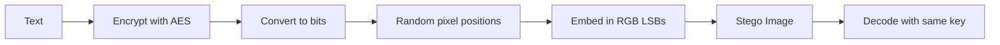

# Fast Secure Steganography Tool


A Python tool to securely hide text in images using **strong AES encryption** and randomized pixel positions. Optimized for large images with a simple **Tkinter GUI**.

---

## 🆕 Update History

### Latest Version (Stego.py)

**Date:** Today

**What’s New:**

* ✅ Added support for **AES-256-GCM** encryption (more secure & modern)
* 🎨 Enhanced GUI for better usability and clarity
* ⚡ Improved overall stability and user experience

### Older Version (OldStego.py)

* Used basic **AES (Fernet)** encryption
* Simpler GUI
* Core LSB steganography functionality

---

## Features

* Encrypt text using **AES-256-GCM** (latest version)
* Hide encrypted data in randomized pixel positions
* Supports PNG and BMP images
* Memory-efficient for large images
* Non-blocking GUI using threading
* Simple and user-friendly Tkinter interface

---

## Installation

Requires Python 3.8+ and the following libraries:

```bash
pip install pillow cryptography
```

Clone the repository:

```bash
git clone https://github.com/wfrefdewwss/secure-lsb-stego.git
cd secure-lsb-stego
```

---

## Usage

### New Version (Recommended)

```bash
python Stego.py
```

### Older Version (Legacy)

```bash
python OldStego.py
```

**Steps:**

1. Generate or paste a key (save it securely).
2. Enter the text you want to hide.
3. Click **Encode**, select a cover image, and save the stego image.
4. To decode, click **Decode**, select the image, and enter the key.

---

## How It Works

1. Text is encrypted using **AES-256-GCM** (or Fernet in older version).
2. Encrypted data is converted to bits.
3. A random sequence of pixel positions is generated from the key.
4. Bits are embedded in the least significant bits of RGB channels.
5. To decode, the same key regenerates the pixel positions to read and decrypt the message.



---

## Notes

* Only text messages are supported.
* Large messages require larger images.
* Clipboard features require `xclip` on Linux.
* This project is experimental and intended for learning/testing purposes.

---

You can find the license in the **LICENSE** file.
