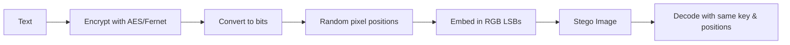

# Fast Secure Steganography Tool


A Python tool to securely hide text in images using **AES encryption** and randomized pixel positions. Optimized for large images with a simple **Tkinter GUI**.

---

## Features

- Encrypt text using AES (Fernet)
- Add support for AES-256-GCM and enhance UI  
- Hide encrypted data in randomized pixel positions  
- Supports PNG and BMP images  
- Memory-efficient for large images  
- Non-blocking GUI using threading  

---

## Installation

Requires Python 3.8+ and the following libraries:

```bash
pip install pillow cryptography
```

Clone the repository:

```bash
git clone https://github.com/wfrefdewwss/secure-lsb-stego.git
cd secure-lsb-stego
```

---

## Usage

1. Run the GUI:

```bash
python Stego.py
```

2. Generate or paste a key (save it securely).  
3. Enter the text you want to hide.  
4. Click **Encode**, select a cover image, and save the resulting stego image.  
5. To decode, click **Decode**, select the image, and enter the key.

---

## How It Works

1. Text is encrypted using AES/Fernet.  
2. Encrypted data is converted to bits.  
3. A random sequence of pixel positions is generated from the key.  
4. Bits are embedded in the least significant bits of RGB channels.  
5. To decode, the same key regenerates the pixel positions to read and decrypt the message.



---

## Notes

- Only text messages are supported.  
- Large messages require larger images.  
- This project is experimental and intended for learning/testing purposes.

---

You can find the license in the **LICENSE** file.
```

